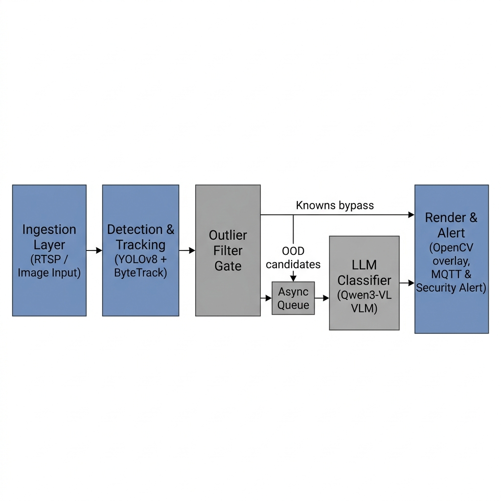

# CV / Anomaly Detection Workspace

This repository contains several related pipelines for object detection and
anomaly detection in images and video:

- **EdgeAnomalyCCTV** (`EdgeAnomalyCCTV/`) — a 5-layer edge pipeline with YOLOv8,
  gating filters, and a VLM outlier classifier.
- **Benchmarking suite** (`EdgeAnomalyCCTV/benchmarks/`) — comprehensive OOD-class
  evaluation, matrix comparisons, and VLM-as-a-judge verification.
- **Presentation** (`edgeanomaly-presentation/`) — a Vite + React frontend for
  demoing / visualizing results.

---

## Setup

```bash
# Create and activate a virtual environment
python3 -m venv venv
source venv/bin/activate

# Install dependencies
pip install -r requirements.txt
```

Model weights are downloaded automatically on first use.

---

## Presentation PDF Export

The presentation deck in `edgeanomaly-presentation/` supports a screenshot-based
PDF export that matches the on-screen slides more closely than the browser-only
export button.

```bash
cd edgeanomaly-presentation
npm install
npx playwright install chromium
npm run export:pdf
```

This command:

- builds the latest presentation
- opens the deck in a headless browser
- captures each slide as a screenshot
- assembles those screenshots into a PDF

The generated file is written to:

```bash
edgeanomaly-presentation/output/pdf/edgeanomalycctv-framework.pdf
```

---

## Benchmarking

The benchmarking suite is the fastest way to evaluate how well the pipeline
detects **out-of-distribution (OOD)** objects — anything that is not in the
COCO closed set.

### Benchmark scripts

| File | Purpose |
|------|---------|
| `00_ood_classes.py` | Curated list of OOD classes and helpers. |
| `01_prepare_openimages_ood.py` | Download / prepare an OOD image benchmark. |
| `02_run_ood_benchmark.py` | Run the full pipeline on the benchmark and report statistics. |
| `03_judge_vlm_correctness.py` | Independently judge VLM decisions (deterministic or LLM-as-a-judge). |
| `main.py` | One-shot orchestrator that runs all of the above. |
| `run_benchmark_matrix.py` | Compare multiple detector/framework variants side-by-side. |

### Detailed benchmark guide

#### 1. Prepare a benchmark

**Small / fast — Caltech101 via torchvision:**

```bash
python EdgeAnomalyCCTV/benchmarks/01_prepare_openimages_ood.py \
    --backend torchvision \
    --torchvision-dataset Caltech101 \
    --max-per-class 3 \
    --output-dir benchmark_data/ood_openimages_small \
    --classes octopus,lobster,scorpion,helicopter,crab,starfish
```

**Larger / more realistic — OpenImages:**

```bash
pip install fiftyone

python EdgeAnomalyCCTV/benchmarks/01_prepare_openimages_ood.py \
    --backend openimages \
    --max-per-class 20 \
    --output-dir benchmark_data/ood_openimages
```

#### 2. Judge VLM decisions (optional)

```bash
# Kimi API judge
python EdgeAnomalyCCTV/benchmarks/03_judge_vlm_correctness.py \
    --summary benchmark_data/ood_results_small/ood_benchmark_summary.json \
    --judge-backend kimi
```

### Benchmark matrix: compare variants

`run_benchmark_matrix.py` runs the same benchmark across multiple
 detector / framework combinations and produces a single combined summary:

```bash
# Small OpenImages benchmark
python EdgeAnomalyCCTV/benchmarks/run_benchmark_matrix.py \
    --backend openimages \
    --max-per-class 3 \
    --benchmark-dir benchmark_data/ood_openimages \
    --output-dir benchmark_data/benchmark_matrix_results \
    --judge-backend kimi

# Larger OpenImages benchmark
python EdgeAnomalyCCTV/benchmarks/run_benchmark_matrix.py \
    --backend openimages \
    --max-per-class 20 \
    --benchmark-dir benchmark_data/ood_openimages \
    --output-dir benchmark_data/benchmark_matrix_results \
    --judge-backend kimi
```

Available variants:

| Variant | Model | Mode |
|---------|-------|------|
| `yolov8n_only` | `yolov8n.pt` | Detector-only evaluation |
| `yolov8n_framework` | `yolov8n.pt` | Full EdgeAnomalyCCTV framework |
| `yolo_world_only` | `yolov8m-world.pt` | Detector-only evaluation |
| `yolo_world_framework` | `yolov8m-world.pt` | Full framework with YOLO-World |
| `vlm_only` | None | VLM-only evaluation |

The combined summary is written to
`benchmark_data/benchmark_matrix_results/benchmark_matrix_summary.json`.

### OOD Evaluation Matrix

The current presentation matrix corresponds to:

- Dataset: `OpenImages OOD (96 pics)`
- Judge: `Kimi VLM`

### Interpreting results

`run_benchmark_matrix.py` prints a final table at the end of execution:

```text
[MATRIX] OOD Evaluation Matrix
Dataset: OpenImages OOD (96 pics)
Judge: Kimi VLM

Variant                          OOD Detection Rate   LLM Judge Accuracy
------------------------------------------------------------------------
yolov8n_only                                  0.00%                0.00%
yolov8n_framework                             0.00%               12.07%
yolo_world_only                              76.92%                5.13%
yolo_world_framework                         76.92%               16.67%
vlm_only                                     92.71%               92.71%
```

#### Key Concepts & Definitions

* **Metrics:**
  * **OOD Detection Rate:** The percentage of out-of-distribution (OOD) objects successfully detected as non-COCO entities.
  * **LLM Judge Accuracy:** The correctness rate of the VLM judge when validating edge-detected anomalies against the ground-truth tags.

* **Evaluation Modes:**
  * **framework:** The complete 5-layer pipeline. YOLO detections are filtered through confidence gates, and uncertain/unknown candidates are verified asynchronously by the VLM.
  * **detector-only (only):** Bypasses gating and VLM verification. Outlier decisions are based solely on raw predictions of non-COCO labels by the YOLO detector.

* **Detector Models:**
  * **YOLOv8n:** A standard closed-set detector limited to the 80 COCO classes. It cannot detect open-vocabulary objects on its own.
  * **YOLO-World:** An open-vocabulary detector capable of recognizing arbitrary classes dynamically via custom text prompts.


## EdgeAnomalyCCTV

A unified framework for outlier anomaly detection supporting both RTSP video
streams and single images.

### Architecture



There are 5 layers:

1. **Ingestion:** Frame buffer from RTSP streams or image inputs.
2. **Detection & Tracking:** YOLOv8 + ByteTrack (for video), YOLOv8 (synthetic tracking for image).
3. **Outlier Filter:** Gates for deduplication, auto-pass, and uncertainty check.
4. **LLM Outlier Classifier:** Qwen3-VL-2B-Instruct outlier-detection async queue.
5. **Render & Alert:** Output overlays, MQTT alerts, or API response.

### Run the pipeline

```bash
# Video / webcam mode
python -u EdgeAnomalyCCTV/src/main.py --mode video

# Single image (default bundled benchmark image)
python EdgeAnomalyCCTV/src/main.py --mode graph

# Single image or video file of your choice
python EdgeAnomalyCCTV/src/main.py --mode graph --input path/to/image.jpg
python EdgeAnomalyCCTV/src/main.py --mode video --input path/to/video.mp4
```

### Single-image sanity check

Run one OOD image through the main pipeline:

```bash
python EdgeAnomalyCCTV/src/main.py --mode graph \
    --input benchmark_data/ood_openimages_small/helicopter/helicopter_5528.jpg
```

---

## Project Layout

```text
.
├── EdgeAnomalyCCTV/
│   ├── src/                          # 5-layer edge pipeline
│   └── benchmarks/                   # OOD-class benchmark helpers + matrix runner
├── benchmark_data/                   # Sample images, videos, and generated OOD benchmarks
│   ├── benchmark_matrix_results/     # Combined matrix benchmark outputs
│   ├── legacy/                       # Original bundled sample media
│   ├── ood_openimages/               # Full OpenImages OOD benchmark
│   ├── ood_openimages_small/         # Small Caltech101 OOD benchmark
│   └── ood_results_small/            # Results for the small benchmark
├── weights/                          # Model weights
│   ├── clip/                         # CLIP weights
│   └── yolo/                         # YOLO .pt files
├── src/                              # (reserved for future core source modules)
├── edgeanomaly-presentation/         # Vite + React presentation frontend
├── requirements.txt                  # Root Python dependencies
└── README.md                         # This file
```
